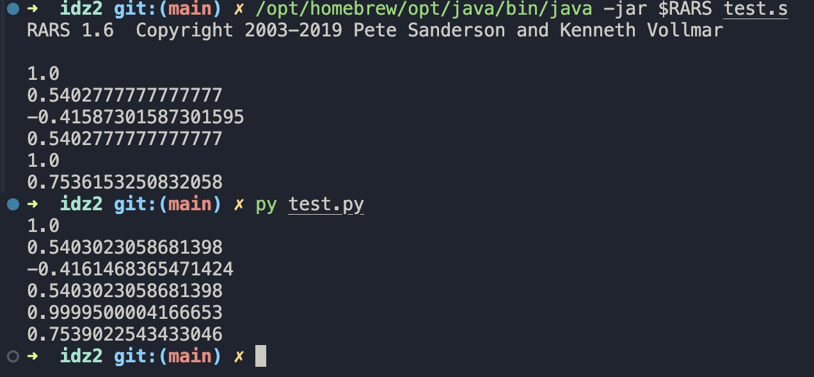

# avs-idz2

> 3\. Разработать программу, вычисляющую с помощью степенного ряда с точностью не хуже 0,1% значение функции cos (x) для заданного параметра x.

Решение разбито на файлы math.s (вычисления), io.s (ввод-вывод), main.s (точка входа). Они содержат **макросы**, которые являются обёрткой над вызовом **подпрограмм**. Подпрограммы получают данные через регистры `a0`, `fa0`, `fa1`, возвращают результат так же через регистры. Некоторые подпрограммы используют **стек**.

Решение сопровождено файлами с **тестами**: `main.py` для одиночного теста, `test.py` и `test.s` запускают несколько тестов автоматически.

## Тесты

Проверка некоторых тривиальных случаев; отрицательных аргументов; близких к граничным значений; случаев, когда аргумент больше 2π. Ответы сравниваются с библиотечной функцией `cos` и отличаются от эталонного значения в рамках погрешности (см. скрин)

## О факториале

В решении (math.s) есть комментарии об использовании факториала (последовательное деление вместо деления целиком). Подход обоснован случаями, когда надо вычислить большое число членов в ряде Тейлора.
